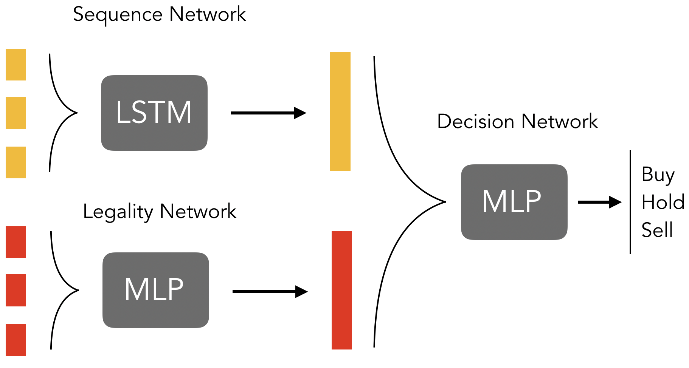
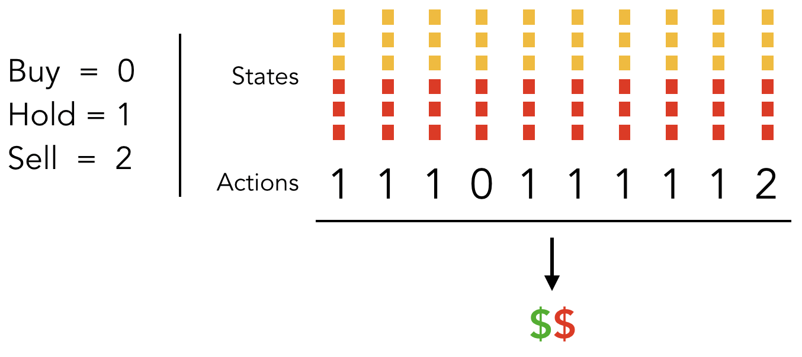

# RLTrading

Deep reinforcement learning for algorithmic cryptocurrency trading.

## Summary

This repo contains all code necessary for training a deep Q-learning agent to trade cryptocurrency, and includes scripts for:

1. Environment configuration
2. Data acquisition via [ccxt](https://github.com/ccxt/ccxt)
3. Pre-processing
4. Training/deployment

Sections 3 and 4 are integrated and controlled via a [configuration script](src/configuration.py). See details in the following sections.

Before we move forward, note that that the current implementation is not restricted to trading cryptocurrencies, and can be applied equally to any stocks trading on any public exchanges. While I haven't integrated the functionality just yet (should be completed soon) I've included 20 years of DJIA data [here](data/djia/) in case you would like to start experimenting on your own. 

## Setup

Note: These instructions and setup scripts assume execution in Linux or MacOS environments with conda (for conda installation, see their [install page](https://docs.conda.io/en/latest/miniconda.html)), and as such may require some tweaking for full functionality on Windows.

Step one: clone this repo:

```{shell}
$ git clone https://github.com/MattsonThieme/RLTrading.git
$ cd RLTrading
```

Then run the following setup script to build and configure a new conda environment:

```{shell}
$ bash env_setup.sh
```

This will create a new environment named `rltrade`. Activate the conda environment, and we're ready to begin working.

```{shell}
$ conda activate rltrade
```

## Data Acquisition

For this project, I have included sample data so you can get started right away, but if you would like to collect your own data on an asset I haven't included, or at a frequency I haven't sampled, or just a larget dataset (GitHub limits file sizes to 100Mb) a script is available in [data/dataCollector.py](data/dataCollector.py). 

To run the collection script, I recommend using a terminal multiplexer like [tmux](https://www.hamvocke.com/blog/a-quick-and-easy-guide-to-tmux/) on a small AWS instance. Edit parameters at the top of the file including 'symbol' and 'delay' then run:

```{shell}
python dataCollector.py
```

This will create and continuously append a file with your target asset's ask price once every sampling period (delay). We'll see in subsequent sections how to use this new file for training (it's as simple as setting a single variable in the configuration file).

## Training

Change directory into `src/`:

```{shell}
$ cd src
```

This folder contains only two files: `configuration.py` and `dqn.py`. Within the `configuration.py` file, you will find all the most important training parameters. 

The most important training parameters are contained in `configuration.py`. Here, you will be able to edit parameters like the size of the replay buffer, update frequencies, and batch size. However, we don't need to edit anything to get started. All necessary data is already contained in [data/](../data/), so we will get right into training.

To initiate training, ensure that you are in the `(rltrade)` environment, and run:

```{shell}
$ python dqn.py
```

When training has begun, a report will be printed after every 20 profitable trades (this frequency can be modified in `configuration.py`). The report will look like the following:

```{shell}
Global start: $12.43, current: :$12.87  -- (995/997)
Market moved $-0.16 over the session
Start: $12.434, current: $12.876
     Session wins: 20 @ $ 0.98, avg hold: 2.0 steps
     Session loss: 13 @ $-0.51, avg hold: 2.0 steps
     Session Net:  $8.45
     Episode total: $33.84
``` 

Here, we can see that market moved down over the last 33 trades (20 profitable, 13 losses) and we made $8.45 - pretty good! We are also shown information about the global start (first ask price in the dataset) and the ask price of the current step. The term `avg hold` represents how long, on average, we held the asset before selling it, and the dollar value after the @ is the average value of all the profitable or unprofitable trades. We can also see that we've made a total of $33.84 over the entire episode.

That's it! Tweak the model parameters and see what helps you earn more money.

:bangbang: Disclaimer :bangbang: The provided sample dataset is very small (GitHub limits us to a max of 100Mb/file). Before deploying any trained models and making real trades, please collect more data using the provided scripts and validate the model over a longer time period. We claim no responsibility for any losses incurred when deloying this model. 

## Model

Now that the model is up and running, here are some details about what is going on under the hood. The custom network topology is shown below.



For interpreting the timeseries data corresponding to historical price movements, we use an LSTM to generate embeddings of the input. Simultaneously, environmental parameters like asset status (is our money in our wallet, or out in the asset?) dictates what trades are legal, so we feed that separately into what we've called a 'legality network'. The outputs of the sequence network and legality network are fed into a final 'decision network' which produces the final decision to either buy, hold, or sell given the historical price data and environmental parameters.

## Rewards

A main challenge in all reinforcement learning is reward engineering, and one of the main contributions of this project is its simple reward scheme, detailed below.



In essence, we recognize that all the steps leading to some final sale contributed to the acquisition of that sale - the time spend holding before the purchase, the purchase price, time spend holding the asset, and finally the sale price. Here, we assign all of those actions the reward of the final sale. This makes intuitive sense while also preventing the model from collapsing into a state in which it is always trying to either buy, hold, or sell.

## I/O


The policy network is a custom network which attends over price movements and environmental parameters separately. Details can be found in the 
